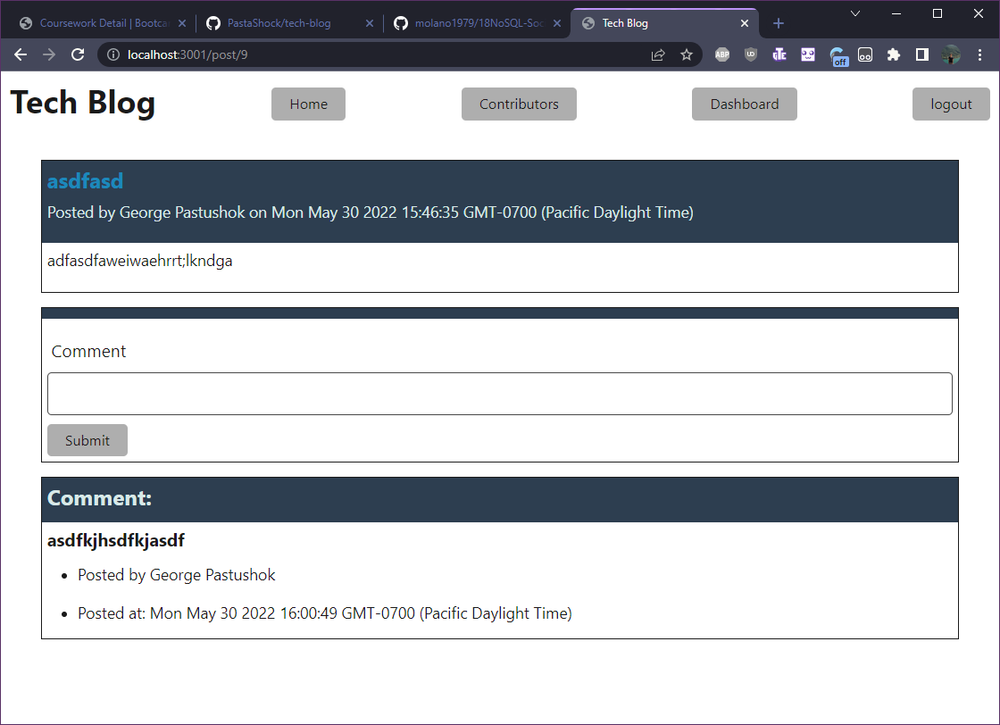

[](http://www.wtfpl.net/about/)
# tech-blog


created by: pastashock

reach me: gpastushok@yahoo.com

github pages: 

github URL: https://github.com/PastaShock/tech-blog


## Table of Contents
- [about](#about)
- [Installation](#Installation)
- [usage](#Usage)
- [contribution](#Contribution)
- [testing](#testing)
- [license](#license)

## About

### Why did I make this project?
I built this project to demonstrate my ability to create a backend and simple front end for a blog style website with authenticaion, users, posts, comments, and the ability to edit posts.



### What makes this app standout?
this project stands out in no ways whatsoever

## Installation
```npm i```

## Usage

npm start

## Contribution
email me

## Testing
```none```

## License
This project is using [](http://www.wtfpl.net/about/)

    